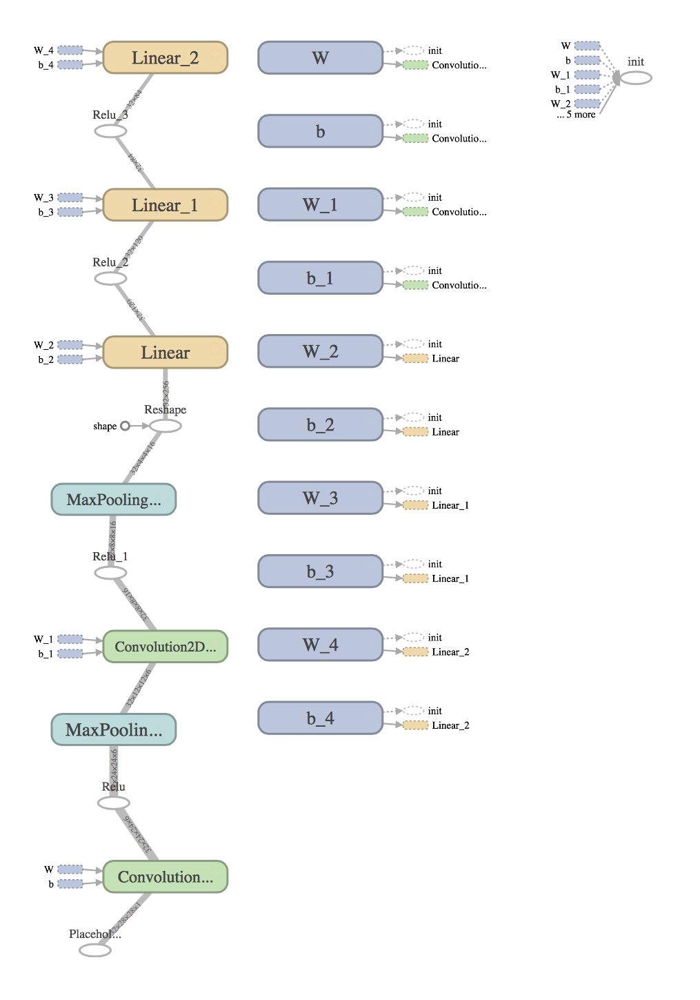

# tfchain

Alternative Chain implementation with TensorFlow backend

# Requirements

- CUDA 8.0
- cuDNN 5.1
- Chainer 1.17.0+
- TensorFlow 0.11.0rc2

## Environmental Setup

```
export TF_BINARY_URL=https://storage.googleapis.com/tensorflow/linux/gpu/tensorflow-0.11.0rc2-cp35-cp35m-linux_x86_64.whl
pip install --upgrade -I setuptools
pip install --upgrade $TF_BINARY_URL
```

# Run tests

```
nosetests -s tests
```

# Run a MNIST example

```
python examples/mnist.py
```

# Usage

Just give a decorator `@totf` to the member function `__call__` of your model class that inherits from `chainer.Chain`. See `examples/mnist.py` and `examples/vgg16.py`.

To visualize your Chainer model using tensorboard, just adding the below line following the model forward calculation part:

```
tf.train.SummaryWriter('data', graph=model.session.graph)
```

It creates `data` dir, so at the place the dir created, just launch tensorboard:

```
$ tensorboard --logdir=$PWD
```

where the path `$PWD` should have `data` dir.

Then go to `GRAPHS` tag, and enjoy the visualized graph.

## Chainer model visualizations

| LeNet5 | VGG16 |
|--------|-------|
|||
